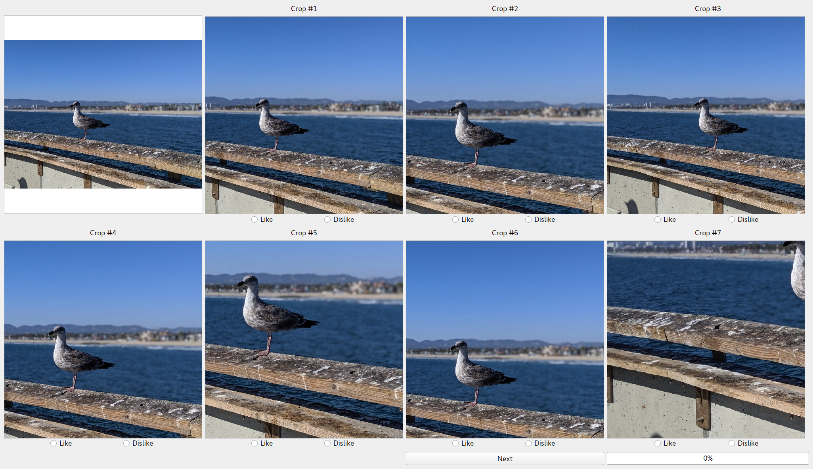

# Crop Evaluation Tool

This tool is to evaluate the performances of 7 different cropping algorithms. In this experiment, there are totally 100 images and each cropping algorithm was asked to generate the best square (1:1) crop. You will be asked to either like or dislike the crop generated by each algorithm. There is no criteria to define whether a crop should be liked or disliked, so you may judge the crop simply by the first impression.

## Getting Started

Clone the project by
```
git clone https://github.com/ycvision/Crop-Evaluation-Tool
```
or download the zip file.

## Dataset

Download the dataset from one of the links below:
* with purdue.edu email: [here](https://purdue0-my.sharepoint.com/:u:/g/personal/cheng159_purdue_edu/EaFQ8UjlR1xGuDHriJ-KnBABzyUwXPzi6Io7GO86dNs09Q?e=J0kQEe)
* with hp.com email: [here](https://hp-my.sharepoint.com/:u:/p/yang_cheng/ETY8oHZhfhdJmunUGsH1rUsB0_LPGOugB72IJdXBnoDAhQ?e=ipgjJs)

Extract the dataset to the current folder. The structure of the folder should look like what is shown below.

## Folder Structure

```
.
├── dataset                   # images
     ├── demo
     ├── method1
     ├── method2
     ├── method3
     ├── method4
     ├── method5
     ├── method6
     ├── method7
├── img                    
├── utils                     
├── main.py                   # the file that needs to be run
├── requirements.txt
└── README.md
```

## Libraries

Following three libraries are required:
1. NumPy
2. OpenCV
3. PyQt5

Install the libraries using the command

```
pip install -r requirements.txt
```

## Instructions



1. Run the following command to open the GUI.

```
python main.py
```

2. A GUI shown in the image above will be displayed
      * The __original uncropped__ image is displayed at the top left corner, and all remaining images are the results of 7 different cropping algorithms.
      * There are two __radio buttons__ below each crop so you may either like or dislike the crop.

3. After either liking or disliking every crop, click the __Next__ button to proceed to the next image.

4. You may exit the GUI anytime. Re-running the command ```python main.py``` will let you continue from where you left off.

5. After liking/disliking every crop of the last image, clicking the __Next__ button will close the window automatically.

## Submission

Upload the file ```results.pkl``` to this website and answer two questions: [https://purdue.ca1.qualtrics.com/jfe/form/SV_3wocl0579kAAz8G](https://purdue.ca1.qualtrics.com/jfe/form/SV_3wocl0579kAAz8G).

__The survey is completely anonymous.__

## Contact

If you have any questions, please contact me at cheng159@purdue.edu.
